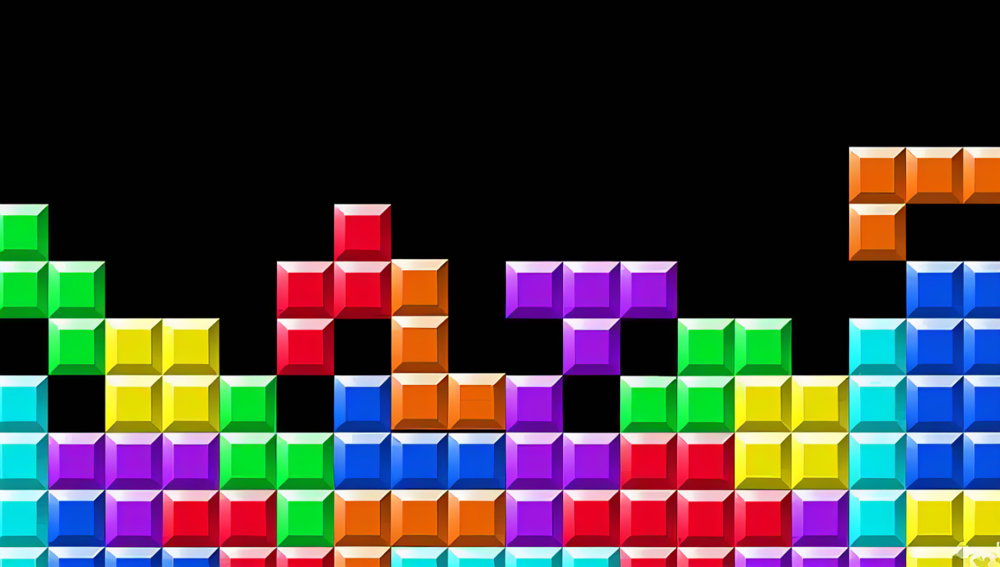

# Majior_Individual_ywan0447

#### Yijun Wang ywan0447

## Instructions on How to Interact with the Work

- **Resize the Window:**  Try resizing the browser window to see how the layout adapts and the Perlin noise-driven animations continue smoothly.

## Individual Approach to Animating the Group Code
- **Animation Driver:**Time-Based
Figuring out how to batch process an array of blocks so that each individual block has its own animation is challenging.

## Animated Properties

- **Falldown:** The small squares and the yellow lines fall at inconsistent speeds and stop falling when they reach the target position.

- **Tetris:** The larger squares fall while rotating and moving, and stop moving and rotating when they reach the target position.

## Inspiration

[link of technical inspiration](https://github.com/pedromocco/tetris)
Since the graphics are made up of blocks, and they are divided into large blocks and small blocks, I thought of making animations that imitate the effect of Tetris.

## Technical Explanation
- **Falldown:**
    1. In `sketch.js`, I removed the original drawing functionality and changed the arrays to global variables. 
    2. In `animation.js`, I used the `map` function to create new arrays to store the values of the images at `y=0`, achieving a partial functionality of falling for the small squares.
        - The use of the map function here comes from [link of map vedio](https://www.youtube.com/watch?v=nicMAoW6u1g&pp=ygUJcDUuanMgbWFw), and with the help of chatGPT, to further understand how to use map to process objects in multiple arrays
    
- **Tetris:**
    1. I set up the animation for the large blocks in tetris: they should rotate while descending and stop rotating when they reach the target coordinates, ensuring the rotation is a multiple of 360 degrees. Each block has a unique rotation magnitude. 
    2. Therefore, I created a new array called rotationAngles and used the `map` function to define their rotation degree. `isRotating` is used to check whether a block should stop rotating. 
    3. To ensure the rotation is centered, I added rectMode within `push()` and `pop()` to control the rotation of each block individually.
    4. To ensure that the squares are 360 degrees at the end of the rotation, I chose `rotationAngles[i] = Math.round(rotationAngles[i] / 360) * 360`to ensure that the rotation angle is an integer multiple of 360.

- **Time:**
    1. To ensure the time order, I used `millis()` to calculate how much time has passed since the animation started, so that the big squares starts moving after the small squares falls. [link of millis() reference](https://p5js.org/zh-Hans/reference/#/p5/millis)